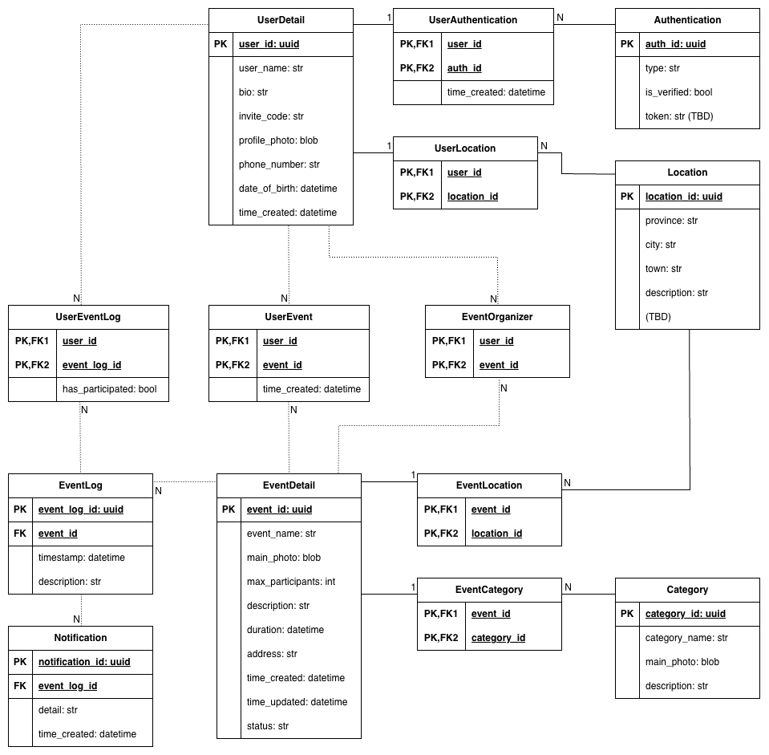

# gloda-backend

gloda-backend is a Django-based backend service that provides RESTful APIs and data management for the Gloda application.

## Features

- Django-powered backend
- RESTful API endpoints
- User authentication and authorization
- Postgres Database integration 
- Input validation and error handling
- Triggered notifications on specific events with Django Celery Beat

## API Documentation

### User Endpoints
- `POST /api/users/` - Create a new user
- `GET /api/users/{id}/` - Retrieve user details
- `/api/

### Event Endpoints

### Notification Endpoints


## Database Design




## Setup Instructions

1. **Create and activate a virtual environment**
    ```bash
    python -m venv venv
    source venv/bin/activate
    cd src
    ```

2. **Install dependencies**
    ```bash
    pip install -r requirements.txt
    ```

3. **Apply database migrations**
    ```bash
    python manage.py migrate
    ```

4. **Create a superuser (optional, for admin access)**
    ```bash
    python manage.py createsuperuser
    ```

5. **Run the development server**
    ```bash
    python manage.py runserver
    ```

The server will be available at `http://127.0.0.1:8000/`.
